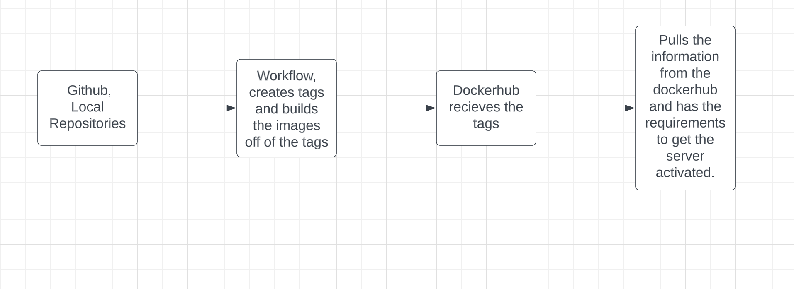

## Semantic Versioning
-For this project we are tagging our commits in github and making webhooks to keep everything up to date. We are also pushing images to the Dockerhub with the tags intact. We are using github and Dockerhub for mostly everything as well as some script files to make everything run more smoothly.

-To create a tag we would use the command 'git log' to find the commit we want to tag. Then use the command 'git tag (tagname) (SHA from the commit)' then push that tag with the command 'git push origin (tagname you created)'
-The work flow action script is supposed to run when a tag is pushed as well as have metadata-action make tags in the repository then push all of the images to Dockerhub with the tags we created as well as the latest version.
[dockerhublink](https://hub.docker.com/repository/docker/yungzooters/repository/general)
## Deployment
- To install docker in the ubuntu instance use the command 'sudo apt-get update' then 'sudo apt-get install docker-ce docker-ce-cli containerd.io' then 'sudo docker run hello-world' to see if everything worked fine.
- The restart script would stop the container and then restart it just in case there were any updates that needed to be done. So running that script would automattically update then restart itself to be online again. The location of the script would be /home/ubuntu/restart.yml
- The command to set up the webhook server would be 'sudo snap install go' then extract the files with the tar command. Then install webhook by using the command 'go install github.com/adnanh/webook@latest' then use the command /home/ubuntu/go/bin/webhook - hooks /home/ubuntu/restart.yml
- The command to start the webhook server would be '$/home/ubuntu -hooks restart.yml -verbose'
- The Webhook task definition file is the file that would dictate where the script about the container restart would work at. It would just be in the ubuntu file but for the project it will be in the deployment directory. 
- To make a listener you would do the command '/home/ubuntu/go/bin/webhook -hooks /home/ubuntu/restart.yml -verbose >> /home/ubuntu/logs'
- To make the Github to message the lisener click on the github repository you want to have it on then click on settigns then click on webhooks. Then click on add webhook then fill out the payload url.
