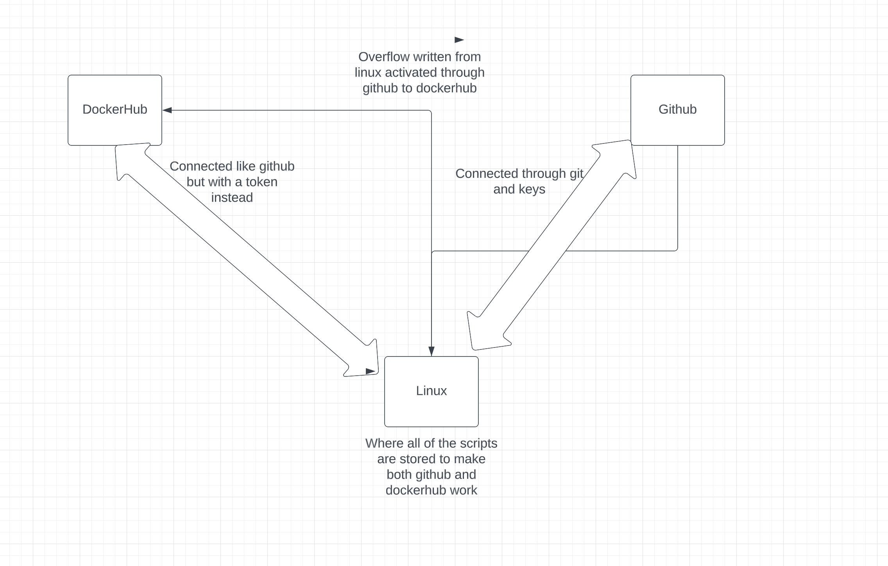

##Dockerfile
- For the project we are installing docker on the local machine and try to get it set up using a dockerfile using either apache or nginx. Using a dockerfile is like using a script and it can help run websites easier. The reason for this is because it is a much cleaner way to do things instead of having it everywhere it will be more neat and easier to read and understand. I ended up using ubuntu, Docker, and the webserver I ended up choosing would be apache. We also learned in this project in part 2 that connecting github to automate dockerhub is much more convientent through github workflow. The command git push activates as script which is the workflow to also build and push docker images to dockerhub so that everything is done with one command instead of multiple commands.

- You install docker by updating it with the command `sudo apt update`. Then the command `sudo apt install docker.io`.
- Since I did the project in the ubuntu server I also used the command `sudo snap install` which installed the dependencies needed for docker.
- Write the command to have it run and execute in the Dockerfile then to build the container I used apache so the command I used was `docker build -t apache_image:1.0 .` Then, in the `docker images` command it should say that it is there.
- Now to run the Docker image as a container I used the command `docker run --name myapache -d -p 80:80 apache_image:1.0`
- To test that it is running properly you just need to write in the browser *http://ubuntuip:80*

## Part 2 Github and DockerHub

- To create the Dockerhub repository, you would sign up and log into their site. Then, create a repository then under visibility click on public and before you hit create a name for it you will need it to help push dockerimages to it. 
- The way I ended up authenticated via CLI to dockerhub was go to click on profile, then security, then access token. You would use this token to connect into it in your local repository. You need to keep the token in a safe place because once you loose the token it will be lost forever.
- To push a container image to Dockerhub you would jsut need to follow the command given to you on the website mine would be `docker push yungzooters/repository:tagname`.
- To set a secret you would go to your repository you want a secret in that you own. Then, go to settings then click on secrets and variables under security. Then click on actions and you want to make two repository secrets.
- The secrets that are set for this project would be one for your dockerhub username and one for your dokerhub password.
- For my github overflow I made it so that everytime I get done pushing to github it would automaticcaly run the dockerfile and build any files that needed to be built then automatically pushed to dockerhub.
- The variables in the workflow are custom to the project would be the docker username password secrets that you had to input, as well as your public username and repository name. Everything else should be the same. 
